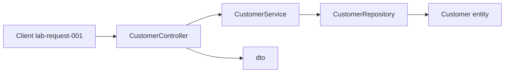

# Layer flow — create Amina Khan (`CUS-1001`)

Correlation ID: `lab-request-001`

## TODO — fill each hop

1. Client sends create request (correlation ID `lab-request-001`)
2. `CustomerController` accepts `CustomerRequest` — presentation owns request/response mapping only; it must not perform validation logic
3. `CustomerService` applies business rules — It assigns a unique customer ID such as CUS 101 then changes the status to ACTIVE when none is supplied.
4. `CustomerRepository` stores `Customer` entity — For current lab, it will go to the memory list but it will be PostgreSQL later.
5. Response DTO returns `CUS-1001` / `ACTIVE` — The Internal storage representation should not leak into the response shape.

## NOW vs FUTURE

- **NOW (Lab 8):** skeleton + stubs only
- **FUTURE:** React SPA, Kafka, PostgreSQL / Spring Boot — out of scope for Lab 8

## Optional Mermaid

